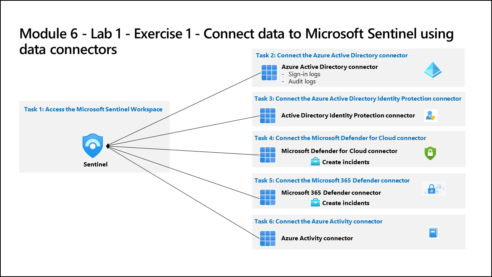

---
lab:
    title: 'Exercise 1 - Connect data to Microsoft Sentinel using data connectors'
    module: 'Learning Path 6 - Connect logs to Microsoft Sentinel'
---

# Learning Path 6 - Lab 1 - Exercise 1 - Connect data to Microsoft Sentinel using data connectors

## Lab scenario

You are a Security Operations Analyst working at a company that implemented Microsoft Sentinel. You must learn how to connect log data from the many data sources in your organization. The organization has data from Microsoft 365, Microsoft 365 Defender, Azure resources, non-azure virtual machines, etc. You start connecting the Microsoft sources first.

### Task 1: Access the Microsoft Sentinel Workspace

In this task, you will access your Microsoft Sentinel workspace.

1. Log in to **WIN1** virtual machine as Admin with the password: **Pa55w.rd**.  

1. Open the Microsoft Edge browser.

1. In the Edge browser, navigate to the Azure portal at https://portal.azure.com.

1. In the **Sign in** dialog box, copy, and paste in the **Tenant Email** account provided by your lab hosting provider and then select **Next**.

1. In the **Enter password** dialog box, copy, and paste in the **Tenant Password** provided by your lab hosting provider and then select **Sign in**.

1. In the Search bar of the Azure portal, type *Sentinel*, then select **Microsoft Sentinel**.

1. Select your Microsoft Sentinel Workspace that you created in the previous lab.

### Task 2: Connect the Azure Active Directory connector

In this task, you will connect the Azure Active Directory connector to Microsoft Sentinel.

1. Under the Configuration area select **Data connectors**. In the Data Connectors page, search for the **Azure Active Directory** connector and select it from the list.

1. Select **Open connector page** on the connector information blade.

1. Select the **Sign-in Logs** and **Audit Logs** options from the Configuration area, then select **Apply Changes**.

### Task 3: Connect the Azure Active Directory Identity Protection connector

In this task, you will connect the Azure Active Directory Identity Protection connector to Microsoft Sentinel.

1. From the Data Connectors Tab, search for the **Azure Active Directory Identity Protection** connector and select it from the list.

1. Select **Open connector page** on the connector information blade.

1. From the Configuration area select the **Connect** button.

### Task 4: Connect the Microsoft Defender for Cloud connector

In this task, you will connect the Microsoft Defender for Cloud connector.

1. From the Data Connectors tab, search for the **Microsoft Defender for Cloud** connector and select it from the list.

1. Select **Open connector page** on the connector information blade.

1. In the Configuration area, under Subscription, select the checkbox for the "Azure Pass - Sponsorship" subscription and slide the **Status** option to the right to indicate **Connected**.

1. The "Status" should be now *Connected* and "Bi-directional sync" should be *Enabled*.

1. Scroll down and under the "Create incidents - Recommended!" area, select **Enable**. This option creates an Analytics rule automatically for this service. You can manually add it later if not enabled here or change its configuration within the *Analytics* blade.

### Task 5: Connect the Microsoft 365 Defender connector

In this task, you will connect the Microsoft 365 Defender connector.

1. From the Data Connectors Tab, search for the **Microsoft 365 Defender (Preview)** connector and select it from the list.

1. Select **Open connector page** on the connector information blade.

1. From the Configuration area select **Connect Incident and Alerts**. 

1. Under "Connect Events", select the **Name** checkbox to select all the checkboxes for "Microsoft Defender for Endpoint".

1. Repeat the same for "Microsoft Defender for Office 365"

1. Scroll to the bottom of the page and select **Apply Changes**.

### Task 6: Connect the Azure Activity connector

In this task, you will connect the Azure Activity connector.

1. From the Data Connectors Tab, search for the **Azure Activity** connector and select it from the list.

1. Select **Open connector page** on the connector information blade.

1. In the Configuration area, scroll down and under "2. Connect your subscriptions..." select **Launch Azure Policy Assignment Wizard>**.

1. In the **Basics** tab, select the ellipsis button (...) under **Scope** and select your "Azure Pass - Sponsorship" subscription from the drop-down list and click **Select**.

1. Select the **Parameters** tab, choose your *uniquenameDefender* workspace from the **Primary Log Analytics workspace** drop-down list.

1. Select the **ReMediation** tab and select the **Create a reMediation task** checkbox.

1. Select the **Review + Create** button to review the configuration.

1. Select **Create** to finish.

## Proceed to Exercise 2
