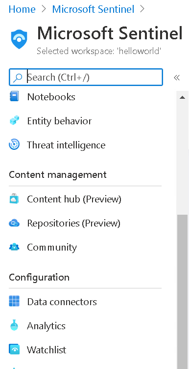

---
lab:
    title: 'Exercise 1 - Connect data to Microsoft Sentinel using data connectors'
    module: 'Module 6 - Connect logs to Microsoft Sentinel'
---

# Module 6 - Lab 1 - Exercise 1 - Connect data to Microsoft Sentinel using data connectors

## Lab scenario

You are a Security Operations Analyst working at a company that implemented Microsoft Sentinel. You must learn how to connect log data from the many data sources in your organization. The organization has data from Microsoft 365, Microsoft 365 Defender, Azure resources, non-azure virtual machines, and network appliances.

You plan on using the Microsoft Sentinel data connectors to integrate the log data from the various sources. You need to write a connector plan for management that maps each of the organization's data sources to the proper Microsoft Sentinel data connector.

### Task 1: Access the Microsoft Sentinel Workspace.

In this task, you will access your Microsoft Sentinel workspace.

1. Log in to WIN1 virtual machine as Admin with the password: **Pa55w.rd**.  

2. Open the Microsoft Edge browser.

3. In the Edge browser, navigate to the Azure portal at https://portal.azure.com.

4. In the **Sign in** dialog box, copy, and paste in the **Tenant Email** account provided by your lab hosting provider and then select **Next**.

5. In the **Enter password** dialog box, copy, and paste in the **Tenant Password** provided by your lab hosting provider and then select **Sign in**.

6. In the Search bar of the Azure portal, type *Sentinel*, then select **Microsoft Sentinel**.

7. Select your Microsoft Sentinel Workspace that you created in the previous lab.

### Task 2: Connect the Azure Active Directory connector.

In this task, you will connect the Azure Active Directory connector to Microsoft Sentinel.

1. In the Configuration area select **Data connectors**.  In the Data Connectors page, search for the **Azure Active Directory** connector and select it from the list.

   

2. Select **Open connector page** on the connector information blade.

3. Select the **Sign-in Logs** and **Audit Logs** options from the Configuration area, then select **Apply Changes**.

### Task 3: Connect the Azure Active Directory Identity Protection connector.

In this task, you will connect the Azure Active Directory Identity Protection connector to Microsoft Sentinel.

1. From the Data Connectors Tab, search for the **Azure Active Directory Identity Protection** connector and select it from the list.

2. Select **Open connector page** on the connector information blade.

3. From the Configuration area select the **Connect** button.

### Task 4: Connect the Microsoft Defender for Cloud connector.

In this task, you will connect the Microsoft Defender for Cloud connector.

1. From the Data Connectors tab, search for the **Microsoft Defender for Cloud** connector and select it from the list.

2. Select **Open connector page** on the connector information blade.

3. In the Configuration area under subscriptions select your Azure subscription and click **Connect**.

4. Read the "Connect" message and select **OK** to continue. Your Azure subscription Status should be now *Connected*.

5. Scroll down and in the Create incidents - Recommended! area, select **Enable**.

### Task 5: Connect the Microsoft Defender for Cloud Apps connector.

In this task, you will connect the Microsoft Defender for Cloud Apps connector.

1. From the Data Connectors Tab, search for the **Microsoft Defender for Cloud Apps** connector and select it from the list.

2. Select **Open connector page** on the connector information blade.

3. Select **Alerts** and then select **Apply Changes**.

### Task 6: Connect the Microsoft Defender for Office 365 connector.

In this task, you will connect the Microsoft Defender for Office 365 connector.

1. From the Data Connectors tab, search for the **Microsoft Defender for Office 365 (Preview)** connector and select it from the list.

2. Select **Open connector page** on the connector information blade.

3. In the Configuration area select **Connect**.

### Task 7: The Microsoft Defender for Identity connector.

In this task, you will review the Microsoft Defender for Identity connector.

1. From the Data Connectors Tab, search for the **Microsoft Defender for Identity** connector and select it from the list.

2. Select **Open connector page** on the connector information blade.

3. Review the Connecting Options. Don't connect. This is for informational purposes only.

### Task 8: Connect the Microsoft Defender for Endpoint connector.

In this task, you will connect the Microsoft Defender for Endpoint connector.

1. From the Data Connectors Tab, search for the **Microsoft Defender for Endpoint** connector and select it from the list.

2. Select **Open connector page** on the connector information blade.

3. In the Configuration area select **Connect**.

### Task 9: Connect the Microsoft 365 Defender connector.

In this task, you will connect the Microsoft 365 Defender connector.

1. From the Data Connectors Tab, search for the **Microsoft 365 Defender (Preview)** connector and select it from the list.

2. Select **Open connector page** on the connector information blade.

3. Select the *Name* checkbox to select all the checkboxes for Microsoft Defender for Endpoint.

4. Select **Apply Changes**.

### Task 10: Connect the Azure Activity connector.

In this task, you will connect the Azure Activity connector.

1. From the Data Connectors Tab, search for the **Azure Activity** connector and select it from the list.

2. Select **Open connector page** on the connector information blade.

3. In the Configuration area select **Launch Azure Policy Assignment Wizard>**.

4. In the **Basics** tab, select the button with the three dots under **Scope** to select your subscription from the drop-down list and click **Select**.

5. Select the **Parameters** tab, choose your Microsoft Sentinel workspace from the **Primary Log Analytics workspace** drop-down list.

6. Select the **Remediation** tab and mark the **Create a remediation task** checkbox.

7. Select the **Review + Create** button to review the configuration.

8. Select **Create** to finish.

## Proceed to Exercise 2
