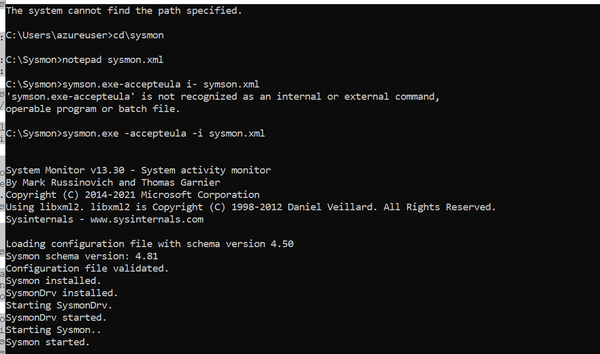

# Module 6 - Lab 1 - Exercise 2 - Connect Windows devices to Microsoft Sentinel using data connectors
 
### Task 1: Connect an Azure Windows virtual machine.

In this task, you will connect an Azure Windows virtual machine to Microsoft Sentinel.

1. In the Search bar of the Azure portal, type **Sentinel**, then select **Microsoft Sentinel**.

1. Select your Microsoft Sentinel Workspace you created earlier.

1. From the Data Connectors Tab, search for the **Security Events via Legacy Agent** connector and select it from the list.

1. Select **Open connector page** on the connector information blade.

1. Select the **Install agent on Azure Windows Virtual Machine** option.

1. Select **Download & install agent for Azure Windows Virtual machines**.

1. Select the **WIN2-DID** virtual machine in the list that was pre-created by the Lab provider, then select **Connect**. Wait until the *connecting...* message disappears.

1. Close the window by selecting the 'x' to go back to **Virtual machines** view. You should now see the virtual machine has a *Log Analytics Connection* to "This workspace".

### Task 2: Connect a non-Azure Windows Machine.

In this task, you will connect a non-Azure Windows virtual machine to Microsoft Sentinel.

1. Login to WIN2 virtual machine as Azureuser Admin with the password as provided in the Environment tab. To do this,

1. Select the magnifying glass (Search Windows) icon on the taskbar at the bottom of the screen and type **RDP** in the Search box that appears.

1. In the **Remote Desktop Connection** window, copy the **Windows VM DNS Name** as provided under Resource group: WIN2 in the Environmnet Tab.

1. In the **Windows Security** window, select **More choices** and then **Use a different account**. Provide the username (.\azureuser) and the password as provided under Resource group: WIN2 in the Environmnet Tab. Click **OK** to connect.

1. You may receive a certificate warning during the sign-in process. Click **Yes** or to create the connection and connect to your deployed VM. You should connect successfully.

1. Open the Microsoft Edge browser.

1. Open a browser and log into the Azure Portal at https://portal.azure.com with the credentials you've been using in the previous labs.

1. In the Search bar of the Azure Portal, type *Sentinel*, then select **Microsoft Sentinel**.

1. Select your Microsoft Sentinel Workspace.

1. In the Configuration area select **Data connectors**. In the Data Connectors page, search for the **Security Events via Legacy Agent** connector and select it from the list.

1. Select **Open connector page** on the connector information blade.

1. In the Select which events to stream area, select **All Events**, then select **Apply Changes**.

1. Select the **Install agent on a non-Azure Windows Machine**.

1. Select **Download & install agent for non-Azure Windows machines**. 

1. Select the link for **Download Windows Agent (64 bit)**.

1. Open the *MMASetup-AMD64.exe* file that is downloaded and select **Yes** to allow the executable to run in the User Account Control window that appears.

1. Select **Next** on the Welcome dialog.

1. If agent is already installed inside the VM, Try to uninstall it and then install it. and  Select **I Agree** on the Microsoft Software License Terms page.  On the Destination prompt select **Next**.

1. On the Agent Setup Options prompt, select **Connect the agent to Azure Log Analytics (OMS)** option, then select **Next**.

1. In the browser with Microsoft Sentinel open, copy the **Workspace ID** from the Agents Management page and paste into the Workspace ID in the dialog. 

1. In the browser with Microsoft Sentinel open, copy the **Primary key** from the Agents Management page and paste into the Workspace key in the dialog. 

1. Select **Next**.

1. Select **Next** on the Microsoft Update page.

1. Then select **Install**.  When complete select **Finish**.

### Task 3: Install and collect Sysmon logs.

In this task, you will install and collect Sysmon logs.

   **Important:** You should still be connected to the WIN2 virtual machine. The following instructions will install Sysmon with the default configuration. You should research community-based configurations for Sysmon to be used on production machines.

1. Open a new tab in the browser, go to https://docs.microsoft.com/sysinternals/downloads/sysmon

1. Download Sysmon from the page by selecting **Download Sysmon**.

1. Hover the *Sysmon.zip* and select the folder icon. Right-click the downloaded file and select **Extract All...** enter *C:\Sysmon* under **Files will be extracted to this folder** and select **Extract**. 

1. In the Windows Taskbar for WIN2 search box, enter *command*.  The search results will show Command Prompt app.  Right-click on the Command Prompt app and select **Run as Administrator**.  Select **Yes** to allow the app to run in the User Account Control window that appears.

1. Enter *cd \sysmon*

1. Type *notepad sysmon.xml* to create a new file. Select **Yes** to confirm the file creation.

1. Open a new tab in the browser, go to: https://github.com/SwiftOnSecurity/sysmon-config/blob/master/sysmonconfig-export.xml

1. Select the **Raw** button and copy the contents of that file from GitHub to the sysmon.xml notepad file you just created. Select **File** and then select **Save** to save the file.

1. In the command prompt type the following and press enter:
    **sysmon.exe -accepteula -i sysmon.xml**

    **Note:**  Verify that "Configuration file validated" and "Sysmon started" messages appear in the output. If that is not the case, verify that the data is properly copied and the sysmon.xml has been saved.

    

1. In the browser, navigate back to the Azure portal at https://portal.azure.com 

1. In the Search bar of the Azure portal, type *Sentinel*, then select **Microsoft Sentinel** and select your Microsoft Sentinel Workspace you created earlier.

1. In Microsoft Sentinel, select **Settings** from the Configuration area and then select **Workspace settings >** tab.

1. Make sure your Microsoft Sentinel Workspace is selected.

1. Select **Agents configuration** from the Settings area.

1. Select the **Windows Event logs** tab.

1. Select **Add windows event log** button.

1. Type **Microsoft-Windows-Sysmon/Operational** in the Log name field.

1. Select **Apply**.

## Proceed to Exercise 3
