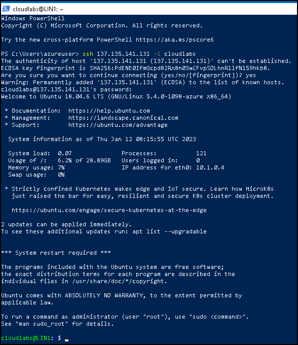
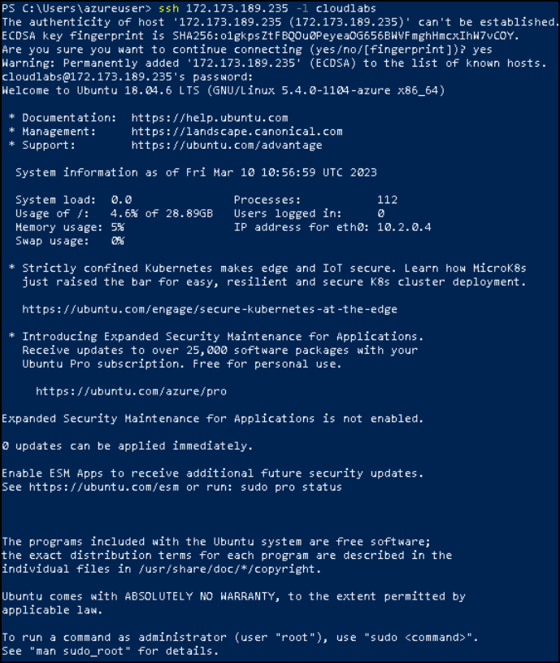

# Hands-on Lab - Exercise 3 - Connect Linux hosts to Microsoft Sentinel using data connectors

## Lab scenario

You are a Security Operations Analyst working at a company that implemented Microsoft Sentinel. You must learn how to connect log data from the many data sources in your organization. The next source of data are Linux virtual machines using the Common Event Formatting (CEF) via Legacy Agent and Syslog connectors.

  >**Important:** There are steps within the next Tasks that are done in different virtual machines. Look for the Virtual Machine name references

### Task 1: Access the Microsoft Sentinel Workspace

In this task, you will access your Microsoft Sentinel workspace.

1. Login to WIN1 virtual machine with the password as provided in the environment tab.

1. In the lab virtual machine, Start the Microsoft Edge browser.

1. In the Edge browser, navigate to the Azure portal at https://portal.azure.com.

1. In the **Sign in** dialog box, copy and paste * Email/Username: <inject key="AzureAdUserEmail"></inject> and then select Next.

1. In the **Enter password** dialog box, copy and paste * Password: <inject key="AzureAdUserPassword"></inject> and then select **Sign in**.

1. In the Search bar of the Azure portal, type *Sentinel*, then select **Microsoft Sentinel**.

1. Select the Microsoft Sentinel Workspace you created in a previous lab.

### Task 2: Connect a Linux Host using the Common Event Format connector

In this task, you will connect a Linux host to Microsoft Sentinel with the Common Event Format (CEF) connector.

1. Select **Data connectors** from the Configuration area in Microsoft Sentinel.

1. Go-to content hub and search  **Common Event Format** and click on install

1. From the Data Connectors tab, search for the **Common Event Format (CEF) via Legacy agent** connector and select it from the list.

1. Select the **Open connector page** on the connector information blade.

1. Under configuration Copy the command shown in **1.2 Install the CEF collector on the Linux machine** and paste on the Notepad.

1. Back to the Azure portal, In the Search bar of the Azure portal, type **virtual machine**, then select **Virtual machine**.

1. Open LIN1 Linux virtual machine and copy the **Public IP address** of LIN1 and paste on the notepad.

1. Go back to the WIN1 virtual machine. launch Windows PowerShell as Administrator by right-clicking the Start menu icon and selecting **Windows PowerShell (Admin)**. Select **Yes** to allow the app to run in the User Account Control window that appears.

1. Enter the following PowerShell command, adjusting for your specific Linux server information, and press enter:

    ```PowerShell
    ssh insert your Linux IP address here -l insert Linux user name here
    ```
    
     >**Note**: Replace **insert your linux IP address** here with pasted on the notepad Public iP address of **LIN1** and **insert linux user name here** with **Admin Username** provided under Resource group: **LIN1** in the **Environment Details** page of the lab guide.

1. Enter **yes** to confirm the connection and then type the user's **password provided under Resource group: LIN1** in the Environment tab and press enter. Your screen should look something like this:

   

1. You are now ready to paste in the **1.2 Install the CEF collector on the Linux machine** from the earlier step. Make sure that the script from Azure is in the clipboard . In PowerShell right-click the top bar and choose **Edit** and then **Paste**. Once pasted add a **3** to the word *python* as shown below:

   
   
    >**Note:** You can also copy from the notepad you have pasted earlier.

1. Once the script is pasted in and adjusted press enter. The script will run against your Linux server remotely. When the script processes properly it should look similar to this screen:

   


### Task 3: Connect a Linux host using the Syslog connector

In this task, you will connect a Linux host to Microsoft Sentinel with the Syslog connector.

1. Go back to the Edge browser. 

1. In the Search bar of the Azure portal, type **Sentinel**, then select **Microsoft Sentinel**.

1. Select the Microsoft Sentinel Workspace you created in a previous lab.

1. Go-to content hub in data connector window search for **syslog** and install it.
  
1. From the **Data Connectors tab**, search for the **Syslog** connector and select it from the list.

1. Select the **Open connector page** on the connector information blade.

1. Under **Configuration**, open the **Install agent on a non-Azure Linux Machine** section.

1. Select the link for **Download & install agent for non-Azure Linux machine**. 

    >**Note:** Your Log Analytics workspace should show **2 Windows computers connected**. This corresponds to WIN2 and AZWIN01 virtual machines connected earlier.

1. Select the tab for **Linux servers**.

    >**Note:** Your Log Analytics workspace should show **1 Linux computers connected**. This corresponds to LIN1 (ubuntu1) virtual machine connected earlier with the CEF connector.

1. Select **Log Analytics agent instructions**.

1. Copy the command in the **Download and onboard agent for Linux** area to the clipboard and paste on the notepad.
   
1. Open LIN2 Linux virtual machine and copy the Public IP address of **LIN2** paste on the notepad.

1. Go back to the WIN1 virtual machine, launch a NEW Windows PowerShell as Administrator by right-clicking the Start menu icon and selecting **Windows PowerShell (Admin)**. Select **Yes** to allow the app to run in the User Account Control window that appears.

   >**Note:** You can reuse the Windows PowerShell window if the **Installation completed** for the last task by entering **exit** to close the connection to LIN1.

1. Enter the following PowerShell command, adjusting for your specific Linux server information, and press enter:

    ```PowerShell
    ssh insert-your-linux-IP-address-here -l insert-linux-user-name-here
    ```

    >**Note**: Replace **insert your linux IP address here** with pasted on the notepad Public iP address of **LIN2** and **insert linux user name here** with **Admin Username** provided under Resource group: **LIN2** in the Environment tab
   
1. Enter **yes** to confirm the connection and then type the user's **password provided under Resource group: LIN2** in the Environment tab and press enter. Your screen should look something like this:

   

1. You are now ready to paste in the **Download and onboard agent for Linux** from the earlier step. Make sure that the script from Azure is in the clipboard. In PowerShell right-click the top bar and choose **Edit** and then **Paste**. 

   >**Note:** You can also copy from the notepad you have pasted earlier.

1. Once the script is pasted in press enter. The script will run against your Linux server remotely. You have completed the task. No further labs in this course rely on this connection.


### Task 4: Configure the facilities you want to collect and their severities for the Syslog connector

In this task, you will configure the Syslog collection facilities.

1. Go back to the Edge browser where you have your Microsoft Sentinel Portal open and close the "Log Analytics workspace" page and the "Syslog" data connector page by selecting the 'x' in the top right corner twice.

1. In Microsoft Sentinel portal, select **Settings** from *Configuration* area and then select **Workspace settings** from the settings blade.

1. On the left menu Select **Legacy agents management** from the **Classic** area.

1. Select the **Syslog** tab.

1. Select the **+ Add facility** button.

1. Select **auth** from the drop-down menu for **Facility name**.

1. Select the **+ Add facility** button again.

1. Select **authpriv** from the drop-down menu for **Facility name**.

1. Select **Apply**.  You have completed this task.

   >**Note:** If you have not perform task 5 in exercise 1 beacause of Licenses takes some time to reflect then please go back to the page 2 and perform task 5 to successfully complete this lab.

## Review 

In this lab you connect azure and non azure virtual machines to Sentinel using data connectors.

> **Congratulations** on completing the task! Now, it's time to validate it. Here are the steps:

- Navigate to the Lab Validation Page, from the upper right corner in the lab guide section.
- Hit the Validate button for the corresponding task. If you receive a success message, you can proceed to the next task. 
- If not, carefully read the error message and retry the step, following the instructions in the lab guide.
- If you need any assistance, please contact us at labs-support@spektrasystems.com. We are available 24/7 to help you out.

## You have completed this lab.
