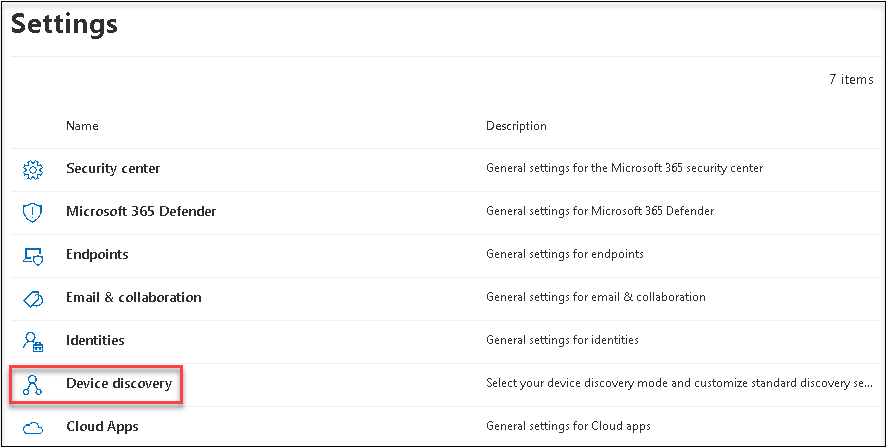
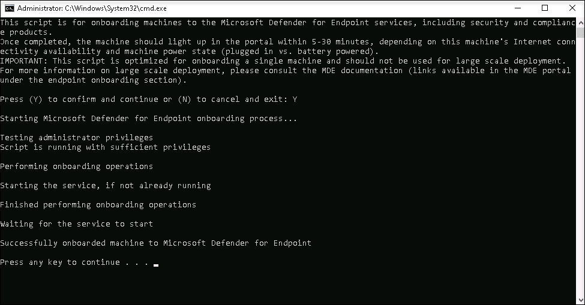
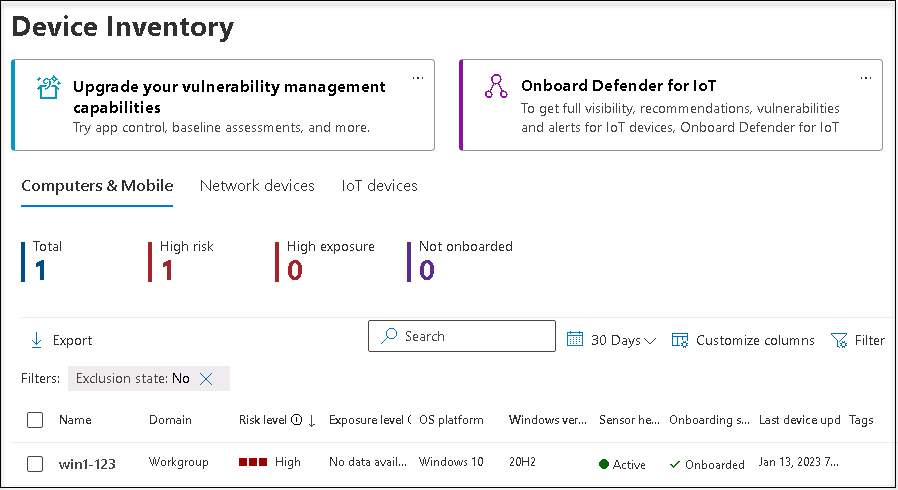

# Module 7 - Lab 1 - Exercise 1 - Activate a Microsoft Security rule

## Lab scenario

You are a Security Operations Analyst working at a company that implemented Microsoft Sentinel. You must learn how to detect and mitigate threats using Microsoft Sentinel.  You need to enable alerts from other Microsoft 365 and Azure services.  

### Task 1: Create a Group 

1. Login to WIN1 virtual machine with the password as provided in the environment tab.

1. Sign in to the [Azure portal](https://portal.azure.com).

1. In the **Sign in** dialog box, copy and paste in the **Username** provided in the environment details page (odl_user_DID@xxxxx.onmicrosoft.com) and then select Next.

1. In the **Enter password** dialog box, copy and paste in the Password and then select **Sign in**.

1. On the **Stay signed in?** dialog box, select the Don’t show this again check box and then select **No**.

1. In the Search bar of the Azure portal, type **Azure Active Directory**, then select Azure Active Directory.

1. Select **Groups** and then click on **New group**.

1. Enter the below details for New group page :

   |Setting|Value|
    |---|---|
    |Group Type| **Microsoft 365** |
    |Group Name| **Sg-IT** |
    |Azure AD roles can be assigned to the group| **Yes** |

1. Click on **no owners selected** and select the **ODL_user** from the list and then click on **select**.

1. Click on **no members selected** and select the **ODL_user** from the list and then click on **select**.

   **Note**: Make sure you have selected **Group type** as Microsoft 365.

1. Select **Create** and click on **Yes**. 

### Task 2: Apply Microsoft Defender for Office 365 preset security policies

In this task, you will assign preset security policies for Exchange Online Protection (EOP) and Microsoft Defender for Office 365 in the Microsoft 365 security portal.

1. In the Edge browser, go to the Microsoft 365 Defender portal at (https://security.microsoft.com).

1. In the **Sign in** dialog box, copy and paste in the tenant Email account for the admin username provided by your lab hosting provider and then select **Next**.

1. In the **Enter password** dialog box, copy and paste in the admin's tenant password provided by your lab hosting provider and then select **Sign in**.

    >**Note:** If you receive a message "The operation could not be completed. Please try again later. If the problem persists, contact Microsoft support." just click **OK** to continue.  

1. If shown, close the Microsoft 365 Defender quick tour.

1. From the navigation menu, under *Email & Collaboration* area, select **Policies & rules**.

1. On the *Policy & rules* dashboard, select **Threat policies**.

1. On the *Threat policies* dashboard, select **Preset Security Policies**.

    >**Note:** If you receive the message *"Client Error - Error when getting bip rule"* select **OK** to continue. The error is due to the hydration status of your tenant at Office 365 which is not enabled by default.

    >**Note:** If you receive the message *"Client Error - An error occurred when retrieving preset security policies. Please try again later."* select **OK** to continue. Refresh your browser using **Ctrl+F5**.

1. Under **Standard protection**, select **Manage protection settings**. **Hint:** If you see this option grayed out, refresh your browser using **Ctrl+F5**.

    >**Note:** After clicking on **Manage protection settings**, This might need 1-2 hours to load the content, wait for 1-2 hours to get loaded the page completely after 1-2 hours back to the same page and might need to sign out of Microsoft defender and sign in again and then try repeating the steps again to move forward. 

1. In the *Apply Exchange Online Protection* section, select **Specific recipients** and under **Domains** start writing your tenant's domain name, select it, and then select **Next**. **Hint:** Your tenant's domain name is the same that you have for your admin account, it might be something like *mocholxxxxx.onmicrosoft.com*. Notice that this configuration applies policies for anti-spam, outbound spam filters, anti-malware, and anti-phishing. 

1. In the **Apply Defender for Office 365 protection** section, apply the same configuration as the previous step and select **Next**. Notice that this configuration applies policies for anti-phishing, Safe Attachments, Safe Links.

1. In the *Impersonation protection* section, select **Next** four times (4x) to continue.

1. In the *Policy mode* section, make sure the **Turn on the policy after I finish** radio button is selected, and then select **Next**.

1. Read the content under *Review and confirm your changes* and select **Confirm** to apply the changes and then select **Done** to finish.

1. Under **Strict protection**, select **Manage protection settings**. **Hint:** *Strict protection* is found under "Email & Collaboration - Policies & rules - Threat policies - Preset security policies".

1. In the **Apply Exchange Online Protection**, select **Specific recipients** and under **Groups** start writing **Sg-IT**, select it, and then select **Next**. Notice that this configuration applies policies for anti-spam, outbound spam filters, anti-malware, and anti-phishing.

1. In the *Apply Defender for Office 365 protection* section, apply the same configuration as the previous step and select **Next**. Notice that this configuration applies policies for anti-phishing, Safe Attachments, Safe Links.

1. In the *Impersonation protection* section, select **Next** four times (4x) to continue.

1. In the *Policy mode* section, make sure the **Turn on the policy after I finish** radio button is selected, and then select **Next**.

1. Read the content under *Review and confirm your changes* and select **Confirm** to apply the changes and then select **Done** to finish.

### Task 1: Initialize Microsoft Defender for Endpoint

In this task, you will perform the initialization of the Microsoft Defender for the Endpoint portal.

1. Log in to WIN1 virtual machine with the password provided in the environment tab.  

1. If you are not already at the Microsoft 365 Defender portal, start the Microsoft Edge browser.

1. In the Edge browser, go to the Microsoft 365 Defender portal at (https://security.microsoft.com).

1. In the **Sign in** dialog box, copy, and paste in the tenant Email account for the admin username provided by your lab hosting provider and then select **Next**.

1. In the **Enter password** dialog box, copy, and paste in the admin's tenant password provided by your lab hosting provider and then select **Sign in**.

    >**Tip:** The admin's tenant email account and password can be found on the Resources tab.

1. On the **Microsoft 365 Defender** portal, from the navigation menu, select **Settings** from the left.

1. On the **Settings** page select **Device discovery**. 

    

    >**Note:** If you do not see the **Device discovery** option under **Settings**, log out by selecting the top-right circle with your account initials and select **Sign out**. Other options that you might want to try are to refresh the page with Ctrl+F5 or wait for 10-15 minutes or open the page InPrivate. Login again with the **Tenant Email** credentials.

1. In the Discovery setup make sure **Standard discovery (recommended)** is selected. 
    >**Hint:** If you do not see the option, refresh the page.

### Task 2: Onboard a Device.

In this task, you will onboard a device to Microsoft Defender for Endpoint using an onboarding script.

1. If you are not already at the Microsoft 365 Defender portal in your browser, start the Microsoft Edge browser and go to (https://security.microsoft.com) and log in with the **Tenant Email** credentials.

1. Select **Settings** from the left menu bar, then from the Settings page select **Endpoints**.

1. Select **Onboarding** in the Device management section.

    >**Note:** You can also perform device onboarding from the **Assets** section of the left menu bar. Expand Assets and select Devices. On the Device Inventory page, with Computers & Mobile selected, scroll down to **Onboard devices.** This takes you to the **Settings > Endpoints** page.

1. In the "1. Onboard a device" area make sure "Local Script (for up to 10 devices)" is displayed in the Deployment method drop-down and select the **Download onboarding package** button. 

1. Under the *Downloads* pop-up, highlight the "WindowsDefenderATPOnboardingPackage.zip" file with your mouse and select the folder icon **Show in folder**. **Hint:** In case you don't see it, the file should be in the c:\users\admin\downloads directory.

1. Right-click the downloaded zip file and select **Extract All...**, make sure that *Show extracted files when complete* is checked and select **Extract**.

1. Right-click on the extracted file "WindowsDefenderATPLocalOnboardingScript.cmd" and select **Properties**. Select the **Unblock** checkbox in the bottom right of the Properties windows and select **OK**.

    

1. Right-click on the extracted file "WindowsDefenderATPLocalOnboardingScript.cmd" again and choose **Run as Administrator**.  **Hint:** If you encounter the Windows SmartScreen window, select on **More info**, and choose **Run anyway**. 
    
1. When the "User Account Control" window is shown, select **Yes** to allow the script to run and answer **Y** to the question presented by the script and press **Enter**. When complete you should see a message in the command screen that says *Successfully onboarded machine to Microsoft Defender for Endpoint*.

1. Press any key to continue. This will close the Command Prompt window.

    

1. Back in the Onboarding page from the Microsoft 365 Defender portal, under the section "2. Run a detection test", copy the detection test script by selecting the **Copy** button.  

1. In the windows search bar of the virtual machine, type **CMD** and choose **Run as Administrator** on the right pane for the Command Prompt app. 

1. When the "User Account Control" window is shown, select **Yes** to allow the app to run. 

1. Paste the script by right-clicking in the **Administrator: Command Prompt** windows and press **Enter** to run it. **Note:** The window closes automatically after running the script.

1. In the Microsoft 365 Defender portal, in the left-hand menu, under the **Assets** area, select **Devices**. If the device is not shown, complete the next task and come back to check it back later. It can take up to 60 minutes for the first device to be displayed in the portal.

     

    >**Note:** If you have completed the onboarding process and don't see devices in the Devices list after an hour, it might indicate an onboarding or connectivity problem.

### Task 2: Create a Log Analytics Workspace and Initialize the Microsoft Sentinel Workspace.

In this task, you will create a Log Analytics workspace for use with Microsoft Defender for Cloud.

1. In the Search bar of the Azure portal, type **Log Analytics**, then select **Log Analytics workspaces**.

1. Select **+Create** from the command bar.

1. Select **RG-Defender** from the drop down.

1. For the Name, enter something unique like **uniquenameDefender**.

1. Select **Review + Create**.

1. Once the workspace validation has passed, select **Create**. Wait for the new workspace to be provisioned, this may take a few minutes.

1. Once again in the Search bar of the Azure portal, type *Sentinel*, then select **Microsoft Sentinel**.

1. Select **+ Create**.

1. Next, In Add Microsoft Sentinel to a workspace page, select your existing workspace that was created in the previous lab, then select **Add**. This could take a few minutes.

1. Navigate around the newly created Microsoft Sentinel workspace to become familiar with the user interface options.

### Task 4: Connect the Microsoft Defender for Cloud connector.

 In this task, you will connect the Microsoft Defender for Cloud connector.

 1. From the Data Connectors tab, search for the **Microsoft Defender for Cloud** connector and select it from the list.

 1. Select the **Open connector page** on the connector information blade.

 1. In the **Configuration** area, under Subscription, select the checkbox for the "Azure Pass - Sponsorship" subscription and slide the **Status** option to the right to indicate **Connected**.

1. The "Status" should be now *Connected* and "Bi-directional sync" should be *Enabled*.

1. Scroll down and under the "Create incidents - Recommended!" area, select **Enable**. This option creates an Analytics rule automatically for this service. You can manually add it later if not enabled here or change its configuration within the *Analytics* blade.

### Task 1: Activate a Microsoft Security Rule

In this task, you will activate a Microsoft Security rule.

1. In the Search bar of the Azure portal, type *Sentinel*, then select **Microsoft Sentinel**.

1. Select your Microsoft Sentinel Workspace you created in the previous labs.

1. Select **Analytics** from the Configuration area. By default, you will see the *Active rules*.

1. Select the **Create incidents based on Microsoft Defender for Cloud**.

1. On the right blade, select the **Edit** button.

1. Scroll down the page and under "Analytics rule logic - Filter by Severity", select the *Custom* drop-down list.

1. Unselect **Low** for the severity level and go back to the rule.

1. Select the **Next: Automated response** button and then select **Next: Review** button.

1. Review the changes made and select the **Save** button. The Analytics rule will be saved.

## Proceed to Exercise 2
