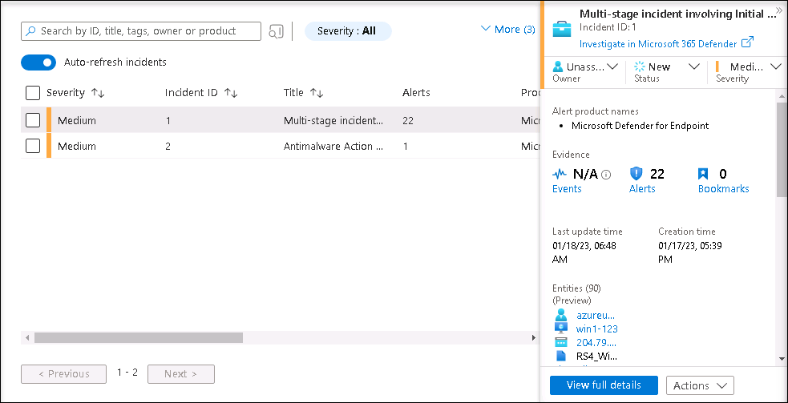

# Module 7 - Lab 1 - Exercise 3 - Create a Scheduled Query

### Task 1: Create a Scheduled Query.

In this task, you will create a scheduled query and connect it to the Teams channel you created in the previous exercise.

1. Log in to WIN1 virtual machine with the password as provided in the Environment tab.  

1. In the **Sign in** dialog box, copy and paste in the **Username** provided in the environment details page (odl_user_DID@xxxxx.onmicrosoft.com) and then select Next.

1. In the **Enter password** dialog box, copy and paste in the Password and then select **Sign in**.

4. In the Search bar of the Azure portal, type *Sentinel*, then select **Microsoft Sentinel**.

5. Select your Microsoft Sentinel Workspace.

6. Select **Analytics** from the Configuration area.

7. Select the **+ Create** button and select **Scheduled query rule**.

8. In the Analytics rule wizard, on the General tab, enter the Name **Azure AD Role Assignment Audit Trail**.

9. For Tactics and techniques, select **Persistence**.

10. For Severity, select **Low**.

11. Select **Next : Set rule logic >** button:

12. For the rule query, paste in the following KQL statement:

    >**Warning:** When using the Paste function to the virtual machine extra (pipe) characters could be added. Make sure you use Notepad first to paste the following query.

```KQL
AuditLogs 
| where isnotempty(InitiatedBy.user.userPrincipalName) and Result == 'success' and OperationName contains "member to role" and AADOperationType startswith "Assign"
| extend InitiatedByUPN = tostring(InitiatedBy.user.userPrincipalName)
| extend InitiatedFromIP = iff(tostring(AdditionalDetails.[7].value) == '', tostring(AdditionalDetails.[6].value), tostring(AdditionalDetails.[7].value))
| extend TargetUser = tostring(TargetResources.[2].displayName)
| extend TargetRoleName = tostring(TargetResources.[0].displayName)
| project TimeGenerated, InitiatedByUPN, InitiatedFromIP, TargetUser, TargetRoleName, AADOperationType, OperationName
```

13. Select **View query results**. You should not receive any results nor any errors. If you receive an error, please review that the query appears just like the previous KQL statement. Close the *Logs* window by selecting the upper right **X** and select **OK** to discard to save changes to go back to the wizard.

14. Back in the "Analytics rule wizard - Create new scheduled rule" blade in the *Alert enhancement* area, select *Entity mapping* ,and select the following values:

    Select **Add new entity** and select the following values:

    - For the *Entity type* drop-down list select **Account**.
    - For the *Identifier* drop-down list select **FullName**.
    - For the *Value* drop-down list select **InitiatedByUPN**.

    Then select **Add new entity** and select the following values:

    - For the *Entity type* drop-down list select **IP**.
    - For the *Identifier* drop-down list select **Address**.
    - For the *Value* drop-down list select **InitiatedFromIP**.

16. In the *Query scheduling* set the following:

    |Setting|Value|
    |---|---|
    |Run Query every|5 minutes|
    |Look data from the last|1 Day|

    >**Note:** We are purposely generating many incidents for the same data.  This enables the Lab to use these alerts.

17. For the *Alert threshold* area, leave the options unchanged.

    >**Note:** Best practices are to manage thresholds in the alert rule KQL query statement.

18. Under the *Event grouping* area, leave the **Group all events into a single alert** as the selected option since we want to generate a single alert every time it runs, as long as the query returns more results than the specified alert threshold above.

19. Select the **Next: Incident settings >** button.  

20. On the *Incident settings* tab, review the default options.

21. Select the **Next: Automated response >** button.

22. Under Automation rules, select **Add new**.

23. For the *Automation rule name*, enter **Tier 2**.

24. For the *Actions*, select **Assign owner**.

25. Then select **Assign to me**. Then select **Apply**.

26. Select the **Next: Review >** button.
  
27. Click on **save**.

### Task 2: Test our new rule.

In this task, you will test your new scheduled query rule.

1. In the Search bar of the Azure portal, type *Azure Active Directory*. Then select **Azure Active Directory**.

2. Select **Users** in the Manage area so the "Users - All users (Preview)" page is displayed.

3. Select user **odl_user** in the list so the "odl_user - Profile" page is displayed.

4. Select **Assigned roles** in the Manage area so the "odl_user - Assigned roles" page is displayed.

5. Select **+ Add assignments** from the command bar.

6. In the **Directory roles** page, search and select **User Administrator**. and select **Add**.

8. Close the "odl_user - Assigned roles" and "Users - All users (Preview)" pages by selecting the 'x' in the top-right twice.

9. In the "MOC HOL" page, under **Monitoring**, select **Audit logs**.

10. Verify that the "Azure Active Directory" data connector was setup correctly in Sentinel by selecting **Export data settings**.

11. Review that there is a **Diagnostic settings** entry for the **Log Analytics workspace** you created earlier for Sentinel.

    

12. Close the page by selecting the 'x' in the top-right.

13. Select **Refresh** until you see the entries for the *Category: RoleManagement* that indicates the change in roles you made earlier.

14. In the Search bar of the Azure portal, type *Sentinel*, then select **Microsoft Sentinel**.

15. Select your Microsoft Sentinel Workspace.

16. Select the **Incidents** menu option.

    >**Note:** The alert triggered may take 5+ minutes to process. You may continue with the next exercise and return to this point later. For automatic updating of the Incidents page, select the **Auto-refresh incidents** toggle.

17. You should see the newly created Incident. Select the Incident and review the information in the right blade.

    

18. Open Microsoft Teams by opening a browser tab and going to https://teams.microsoft.com. Go to the *SOC* Team and see the message post about the incident.

## Proceed to Exercise 4
