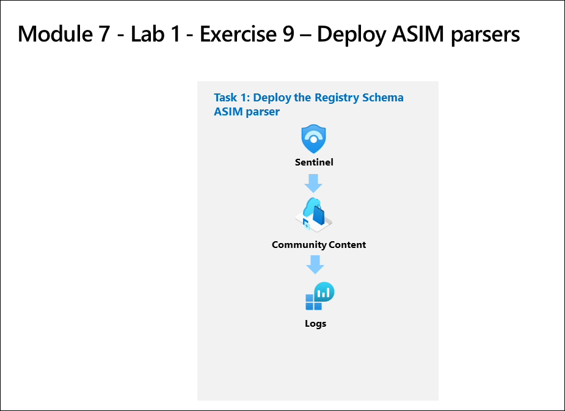

# Module 7 - Lab 1 - Exercise 9 - Create ASIM parsers

## Lab scenario

You are a Security Operations Analyst working at a company that implemented Microsoft Sentinel. You need to model ASIM parsers for a specific Windows registry event. These simplified parsers will be finalized at a later time following the [Advanced Security Information Model (ASIM) Registry Event normalization schema reference](https://docs.microsoft.com/en-us/azure/sentinel/registry-event-normalization-schema).

>**Note:** An **[interactive lab simulation](https://mslabs.cloudguides.com/guides/SC-200%20Lab%20Simulation%20-%20Create%20Advanced%20Security%20Information%20Model%20Parsers)** is available that allows you to click through this lab at your own pace. You may find slight differences between the interactive simulation and the hosted lab, but the core concepts and ideas being demonstrated are the same. 

### Task 1: Deploy the Registry Schema ASIM parser. 

1. In the Search bar of the Azure portal, type *Sentinel*, then select **Microsoft Sentinel**.

1. Select your Microsoft Sentinel Workspace you created earlier.

1. Select the **Community** page under the *Content management* area on the left side of the page.

1. On the right pane, select the **Onboard community content** link. This will open a new tab in the Edge Browser for Microsoft Sentinel GitHub content. **Hint:** You might need to scroll right to see the link. Alternatively, follow this link instead: [Microsoft Sentinel on GitHub](https://github.com/Azure/Azure-Sentinel).

1. Select the **ASIM** folder. In here, you can deploy a template that contains all ASIM parsers, but we will only focus on the Registry Schema.

1. Scroll down and next to **Registry**, select the **Deploy to Azure** button.

1. For *Resource Group*, select **RG-Defender** where your Sentinel workspace resides.

1. For *Workspace*, type your Sentinel workspace name, like *uniquenameDefender*.

1. Leave the other default values and select **Review + create**.

1. Select **Create** to deploy the template. Notice the Names of the different resources.

1. In the Search bar of the Azure portal, type *Sentinel*, then select **Microsoft Sentinel**.

1. Select your Microsoft Sentinel Workspace you created earlier.

1. Select **Logs** under the *General* left menu.

1. Open the *Schema and Filter* blade by selecting **>>** if needed.

1. Select the **Functions** tab (next to the Tables and Queries tabs). **Hint:** You might need to select the ellipsis icon **(...)** to select the tab.

1. Expand **Worspace functions**. Notice that the names correspond to the templates you just deployed.

1. Hover the **vimRegistryEventMicrosoftSecurityEvents** *workspace parser* and then select **Load the function code**.

1. Review the KQL that is parsing the Event ID 4657 to simplifying your analysis of the data in the Microsoft Sentinel workspace.

1. **Run** the query. You should not get any result nor errors, it is just for validation purposes.

1. Go back to the *Schema and Filter* blade and now hover the **inRegistry** *unifying parser* and then select **Load the function code**.

1. Notice that the unifying parsers uses the *union* operator to run all the workspace parsers at once. If you develop a parser for the Registry Schema you will need to add it here.

1. **Run** the query. You should not get any result nor errors, it is just for validation purposes.

1. This unifying parser can now be used for Analytic Rules or Hunting Queries.

## Proceed to Exercise 10

