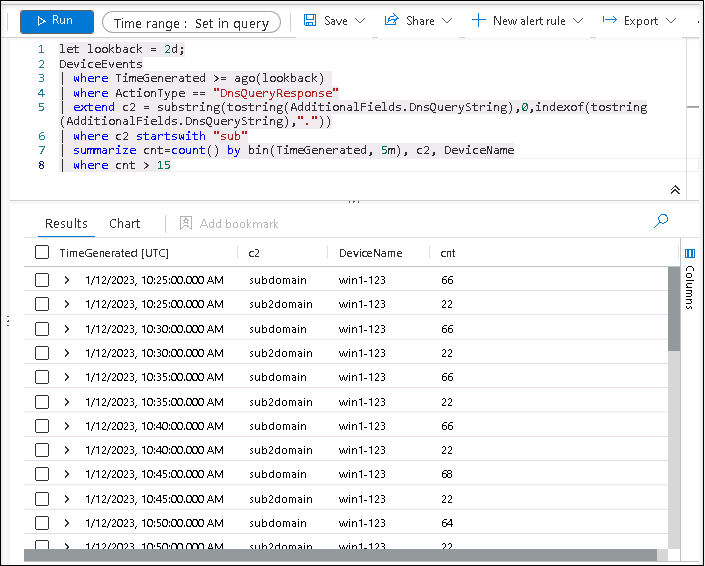
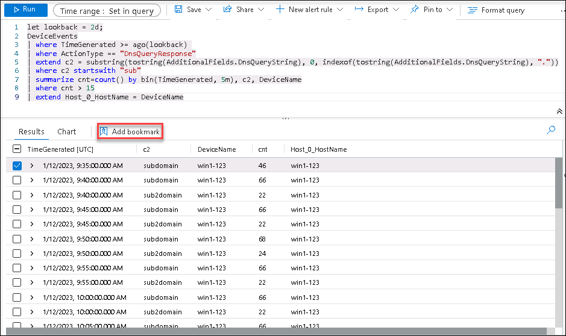
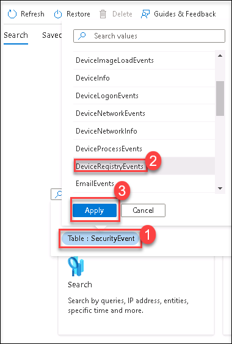

# Module 8 - Lab 1 - Exercise 1 - Perform Threat Hunting in Microsoft Sentinel

## Lab scenario

You are a Security Operations Analyst working at a company that implemented Microsoft Sentinel. You have received threat intelligence about a Command and Control (C2 or C&C) technique.  You need to perform a hunt and watch for the threat.

   **Important:** The log data used in the lab was created in the previous module. See **Attack 3** in WIN1 server in Exercise 5.

   **Note:**  Because you already experienced the process of exploring data in a previous module, the lab provides a KQL statement to start with.  

## Estimated timing: 120 minutes

### Task 1: Create a hunting query

In this task, you will create a hunting query, bookmark a result, and create a Livestream.

1. Log in to WIN1 virtual machine with the password as provided in the Environment tab.  

1. In the Edge browser, navigate to the Azure portal at https://portal.azure.com.

1. In the **Sign in** dialog box, copy and paste in the **Username** provided in the environment details page (odl_user_DID@xxxxx.onmicrosoft.com) and then select Next.

1. In the **Enter password** dialog box, copy and paste in the Password and then select **Sign in**.

1. In the Search bar of the Azure portal, type **log analytics workspace**, then select **log analytics workspace**.

1. In the creation page in resource group tab create new and name it as **rg-defender**

1. Name your workspace as **uniquenameDefender**

1. And click on create  

1. In the Search bar of the Azure portal, type *Sentinel*, then select **Microsoft Sentinel**.

1. Select your Microsoft Sentinel Workspace.

1. On the left menu Select **Logs** 

1. Enter the following KQL Statement in the New Query 1 space:

   >**Important:** Please paste any KQL queries first in Notepad and then copy from there to the *New Query 1* Log window to avoid any errors.

```KQL
let lookback = 2d;
DeviceEvents
| where TimeGenerated >= ago(lookback) 
| where ActionType == "DnsQueryResponse"
| extend c2 = substring(tostring(AdditionalFields.DnsQueryString),0,indexof(tostring(AdditionalFields.DnsQueryString),"."))
| where c2 startswith "sub"
| summarize count() by bin(TimeGenerated, 3m), c2
| where count_ > 5
| render timechart 
```

   

9. The goal of this statement is to provide a visualization to check for a C2 beaconing out on a consistent basis. Take time to adjust the 3m setting to 30s in the summarize operator and more. Change the count_ > 5 setting to other threshold counts to witness the impact.

10. You have now identified DNS requests that are beaconing to a C2 server.  Next, determine which devices are beaconing.  Enter the following KQL Statement:

```KQL
let lookback = 2d;
DeviceEvents
| where TimeGenerated >= ago(lookback) 
| where ActionType == "DnsQueryResponse"
| extend c2 = substring(tostring(AdditionalFields.DnsQueryString),0,indexof(tostring(AdditionalFields.DnsQueryString),"."))
| where c2 startswith "sub"
| summarize cnt=count() by bin(TimeGenerated, 5m), c2, DeviceName
| where cnt > 15
```

   

   >**Note:** The generated log data is only from one device.

11. Close the Logs window by selecting the 'x' in the top-right of the window and select **OK** to discard the changes. Select your Microsoft Sentinel workspace again and select the **Hunting** page under the Threat Management area.

12. Select **+ New Query** from the command bar.

13. In the *Create custom query* window, for the *Name* type **C2 Hunt**

14. For the **Custom query** enter the following KQL statement:

```KQL
let lookback = 2d;
DeviceEvents
| where TimeGenerated >= ago(lookback) 
| where ActionType == "DnsQueryResponse"
| extend c2 = substring(tostring(AdditionalFields.DnsQueryString),0,indexof(tostring(AdditionalFields.DnsQueryString),"."))
| where c2 startswith "sub"
| summarize cnt=count() by bin(TimeGenerated, 5m), c2, DeviceName
| where cnt > 15
```

15. In the *Entity mapping* select **+ Add new entity**:

    - For the *Entity type* drop-down list select **Host**.
    - For the *Identifier* drop-down list select **HostName**.
    - For the *Value* drop-down list select **DeviceName**.

16. Scroll down and under *Tactics & Techniques* select **Command and Control** and then select **Create** to create the hunting query.

17. In the *"Microsoft Sentinel - Hunting"* blade, search for the query you just created in the list, *C2 Hunt*.

18. Select **C2 Hunt** from the list.

19. On the right pane, scroll down and select the **Run Query** button.

20. The number of results is shown in the middle pane under the *Results* column. Alternatively, scroll up to see the count over the *Results* box.

21. Select the **View Results** button. The KQL query will automatically run.

22. Select the checkbox of the first row in the results. 

23. In the middle command bar, select the **Add bookmark** button.

    

24. Review the values populated by default and in the *Add bookmark* blade, select **Create**.

25. Close the *Logs* window by selecting the **X** in the top-right of the window and select **OK** to discard the changes. 

26. Back in the Hunting page in the Microsoft Sentinel portal, select the **Bookmarks** tab in the middle pane.

27. Select the **C2 Hunt** bookmark you just created from the results list.

28. On the right pane, scroll down and select the **Investigate** button. **Hint:** It might take a couple of minutes to show the investigation graph.

29. Explore the Investigation graph just like you did in the previous module.

30. Close the *Investigation* graph window by selecting the **X** in the top-right of the window and select **OK** to discard the changes. 

31. Select the **Queries** tab.

32. Search again for and select your **C2 Hunt** query.

33. Right-click your query and select **Add to livestream**. **Hint:** This also can be done by sliding right and selecting the ellipsis **(...)** at the end of the row to open a context menu.

34. Review that the *Status* is now *Running*. 

35. In "Module 7 - Lab 1 - Exercise 6 - Task 1 - Attack 3" you executed a PowerShell script to simulate a C2 attack. Go back to the Command Prompt window, enter the following command from C:\Temp and press Enter. 

    >**Note:** A new PowerShell window will open and you will see resolve errors. This is expected.

    ```CommandPrompt
    Start PowerShell.exe -file c2.ps1
    ```

36. You will receive a notification in the Azure Portal (bell icon) when we find a result.


### Task 2: Create a NRT query rule

In this task, instead of using a LiveStream, you will create a NRT analytics query rule. NRT rules run every minute and lookback one minute. The benefit to NRT rules are they can use the alert and incident creation logic.


1. Select the **Analytics** page in Microsoft Sentinel. 

1. Select the **Create** tab, then **NRT query rule (Preview)**.

1. This starts the "Analytics rule wizard". For the *General* tab type:

    |Setting|Value|
    |---|---|
    |Name|**NRT C2 Hunt**|
    |Description|**NRT C2 Hunt**|
    |Tactics|**Command and Control**|
    |Severity|**High**|

1. Select **Next: Set rule logic >** button. 

1. For the *Rule query* enter the following KQL statement:

    ```KQL
    let lookback = 2d;
    DeviceEvents | where TimeGenerated >= ago(lookback) 
    | where ActionType == "DnsQueryResponse"
    | extend c2 = substring(tostring(AdditionalFields.DnsQueryString),0,indexof(tostring(AdditionalFields.DnsQueryString),"."))
    | where c2 startswith "sub"
    | summarize cnt=count() by bin(TimeGenerated, 3m), c2, DeviceName
    | where cnt > 5
    ```

1. Leave the rest of the options with the defaults. Select **Next: Incident settings>** button.

1. On the *Review* tab, select the **Save** button to create the new Scheduled Analytics rule.

1. Select the **Incidents** page in Microsoft Sentinel, within the *Threat management* section and wait for the new *C2 Hunt* alert to appear.


### Task 3: Create a Search

In this task, you will use a Search job to look for a C2. 

1. Select the **Search** page in Microsoft Sentinel. 

1. Select the **Restore** button from the command bar.

    >**Note:** The lab does not have Archived tables to restore from. The normal process would restore archived tables to include in the Search job.

1. Review the options available and select the **Cancel** button.

1. Select the **Search** tab.

1. Select the *Table* filter below the search box and change it to **DeviceRegistryEvents** and the select **Apply**.

   

1. In the search box, enter **reg.exe** and then select **Run search**.

1. Select the **Saved Searches** tab.

1. The search job will create a new table named **DeviceRegistryEvents_####_SRCH**.

1. Wait for the search job to complete. The status will display *Updating*, then *In progress* and finally *Search completed*.

1. Select **View search results**. This will open a new tab in *Logs* and query your new table name **DeviceRegistryEvents_####_SRCH** and display the results.


## Proceed to Exercise 2
