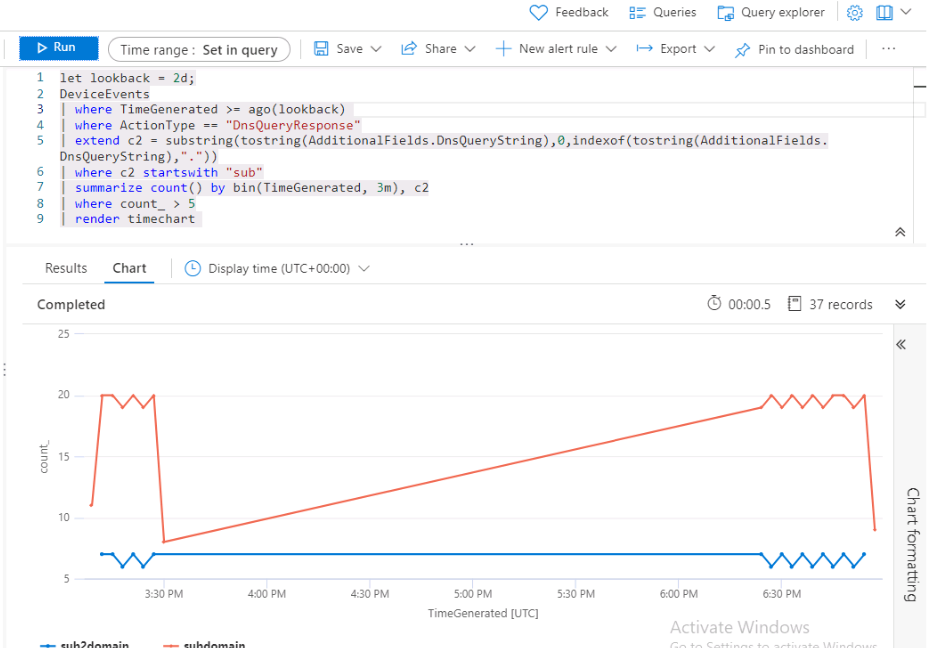

---
lab:
    title: 'Exercise 1 - Perform Threat Hunting in Microsoft Sentinel'
    module: 'Module 8 - Perform threat hunting in Microsoft Sentinel'
---

# Module 8 - Lab 1 - Exercise 1 - Perform Threat Hunting in Microsoft Sentinel

## Lab scenario

You are a Security Operations Analyst working at a company that implemented Microsoft Sentinel. You have received threat intelligence about a Command and Control (C2 or C&C) technique.  You need to perform a hunt and watch for the threat.

>**Important:** The log data used in the lab was created in the previous module. See **Attack 3** in WIN1 server in Exercise 5.

>**Note:**  Because you already experienced the process of exploring data in a previous module, the lab provides a KQL statement to start with.  


### Task 1: Create a hunting query

In this task, you will create a hunting query, bookmark a result, and create a Livestream.

1. Log in to WIN1 virtual machine as Admin with the password: **Pa55w.rd**.  

2. In the Edge browser, navigate to the Azure portal at https://portal.azure.com.

3. In the **Sign in** dialog box, copy and paste in the **Tenant Email** account provided by your lab hosting provider and then select **Next**.

4. In the **Enter password** dialog box, copy and paste in the **Tenant Password** provided by your lab hosting provider and then select **Sign in**.

5. In the Search bar of the Azure portal, type *Sentinel*, then select **Microsoft Sentinel**.

6. Select your Microsoft Sentinel Workspace.

7. Select **Logs** 

8. Enter the following KQL Statement in the New Query 1 space:

   >**Important:** Please paste any KQL queries first in Notepad and then copy from there to the *New Query 1* Log window to avoid any errors.

```KQL
let lookback = 2d;
DeviceEvents
| where TimeGenerated >= ago(lookback) 
| where ActionType == "DnsQueryResponse"
| extend c2 = substring(tostring(AdditionalFields.DnsQueryString),0,indexof(tostring(AdditionalFields.DnsQueryString),"."))
| where c2 startswith "sub"
| summarize count() by bin(TimeGenerated, 3m), c2
| where count_ > 5
| render timechart 
```

   

9. The goal of this statement is to provide a visualization to check for a C2 beaconing out on a consistent basis. Take time to adjust the 3m setting to 30s in the summarize operator and more. Change the count_ > 5 setting to other threshold counts to witness the impact.

10. You have now identified DNS requests that are beaconing to a C2 server.  Next, determine which devices are beaconing.  Enter the following KQL Statement:

```KQL
let lookback = 2d;
DeviceEvents
| where TimeGenerated >= ago(lookback) 
| where ActionType == "DnsQueryResponse"
| extend c2 = substring(tostring(AdditionalFields.DnsQueryString),0,indexof(tostring(AdditionalFields.DnsQueryString),"."))
| where c2 startswith "sub"
| summarize cnt=count() by bin(TimeGenerated, 5m), c2, DeviceName
| where cnt > 15
```

   

   >**Note:** The generated log data is only from one device.

11. Close the Logs window by selecting the 'x' in the top-right of the window and select **OK** to discard the changes. Select your Microsoft Sentinel workspace again and select the **Hunting** page under the Threat Management area.

12. Select **+ New Query** from the command bar.

13. For the **Custom query** enter the following KQL statement:

```KQL
let lookback = 2d;
DeviceEvents
| where TimeGenerated >= ago(lookback) 
| where ActionType == "DnsQueryResponse"
| extend c2 = substring(tostring(AdditionalFields.DnsQueryString),0,indexof(tostring(AdditionalFields.DnsQueryString),"."))
| where c2 startswith "sub"
| summarize cnt=count() by bin(TimeGenerated, 5m), c2, DeviceName
| where cnt > 15
```

14. For the Name enter type *C2 Hunt*

15. In the *Entity mapping (Preview)* select **+ Add new entity**:

    - For the *Entity type* drop-down list select **Host**.
    - For the *Identifier* drop-down list select **HostName**.
    - For the *Value* drop-down list select **DeviceName**.

16. In the *Tactics & Techniques* select **Command and Control**. Select **Create** to create the hunting query.

17. In the Microsoft Sentinel - Hunting blade search for the query you just created in the list, *C2 Hunt*.

18. Select **C2 Hunt** in the list.

19. Select the **Run Query** button on the right side of the page.

20. The result count is displayed at the top of the flyout.

21. Select the **View Results** button.

22. Select the first row in the results. 

23. Select the **Add bookmark** button.

24. In the Add bookmark blade select **Create**.

25. Return to the Hunting page in the Microsoft Sentinel portal (hint: scroll to the left).

26. Select the **Bookmarks** tab.

27. Select the bookmark you just created in the results list.

28. Select the **Investigate** button.

29. Explore the Investigation graph.

30. Return to the Hunting page in the Microsoft Sentinel portal by closing the window selecting the 'x' in the top-right.

31. Select the **Queries** tab

32. Search again for and s elect the **C2 Hunt** query.

33. Select the **...** at the end of the row to the right to open the context menu.

34. Select **Add to livestream**.

# Proceed to Exercise 2
