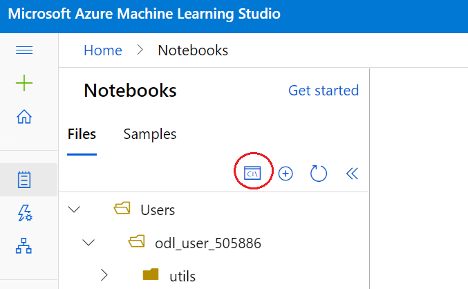

# Module 8 - Lab 1 - Exercise 2 - Threat Hunting using Notebooks with Microsoft Sentinel

## Lab scenario

You are a Security Operations Analyst working at a company that implemented Microsoft Sentinel. You need to explore the benefits of threat hunting with Microsoft Sentinel Notebooks.

### Task 1: Explore Notebooks

In this task, you will explore using notebooks in Microsoft Sentinel.

1. Log in to WIN1 virtual machine with the password as provided in the Environment tab.  

2. In the Edge browser, navigate to the Azure portal at https://portal.azure.com.

3. In the **Sign in** dialog box, copy and paste in the **Username** provided in the environment details page (odl_user_DID@xxxxx.onmicrosoft.com) and then select Next.

4. In the **Enter password** dialog box, copy and paste in the Password and then select **Sign in**.

5. In the Search bar of the Azure portal, type *Sentinel*, then select **Microsoft Sentinel**.

6. Select your Microsoft Sentinel Workspace.

7. In the Microsoft Sentinel Workspace, select **Notebooks**.

8. Next, you need to select an AzureML Workspace. Select **Configure Azure Machine Learning** and then select  **Create new Azure ML workspace** button in the command bar.

9. In the Subscription box, select your subscription.

10. Select **Create new** for the Resource group and enter *RG-MachineLearning* for the Name and select **OK**. 

11.	In the Workspace details section do the following:

    - Give your workspace a unique name.
    - Choose your Region (it should default with a reasonable option)
    - Keep the default Storage account, Key vault, and Application insights information.
    - The Container registry option can remain as **None**.

12.	At the bottom of the page, select **Review + create**. Then on the next page, select **Create**. 

     >**Note:** It may take a few moments to deploy the Machine Learning workspace. 

13.	After the deployment is finished, return to the Microsoft Sentinel portal.

14. Select **Notebooks** and then select the **Templates** tab. 

15. Select **A Getting Started Guide for Microsoft Sentinel ML Notebooks**. 

16. On the right pane, scroll down and select **Create from template** button. Review the default option and select **Save**.

17. Select the **Launch notebook** button. Close any window that may appear in the Microsoft Azure Machine Learning Studio.

          

    

18.	Next to the **Compute:** instance selector at the top of the screen, select the **+** symbol for **New Compute**.

19.	Type a unique name for the *Compute name* and select the first compute available since this is a lab environment. **Hint:** Workload type: Development.

20.	Select the **Create** button at the bottom of the screen. Close any feedback window that may appear. This will take a few minutes.

21.	Once the Compute has been created and running, in the top right of the notebook, verify that the kernel to use is *Python 3.8 - AzureML*.

22.  Select the **Authenticate** button and wait for the authentication to complete.

23. Clear all the results from the notebook by selecting the **Clear all outputs** from the command bar and follow the *Getting Started* tutorial. **Hint:** This can be found by selecting the ellipsis (...) from the command bar.

    

    **Note** If you cannot complete the steps above to access the notebook, you can view it on its GitHub page instead.  See the notebook file here: [Azure Sentinal Notebooks on GitHub](https://github.com/Azure/Azure-Sentinel-Notebooks/blob/8122bca32387d60a8ee9c058ead9d3ab8f4d61e6/A%20Getting%20Started%20Guide%20For%20Azure%20Sentinel%20ML%20Notebooks.ipynb) 

## You have completed the lab.
